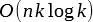
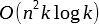

# 2.1 Anagrams

## Definition

A word _w_ is an anagram of another word _v_ if it exists a permutation of the letters that transforms _w_ in _v_.

**complexity**: between  and 

**input**: a string  
**ouptut**: list of anagrams (e.g. `[['chien', 'chine', 'niche'], ['limace', 'malice']]`)  

## usage

```sh
$ python anagrams.py < data.in
```
